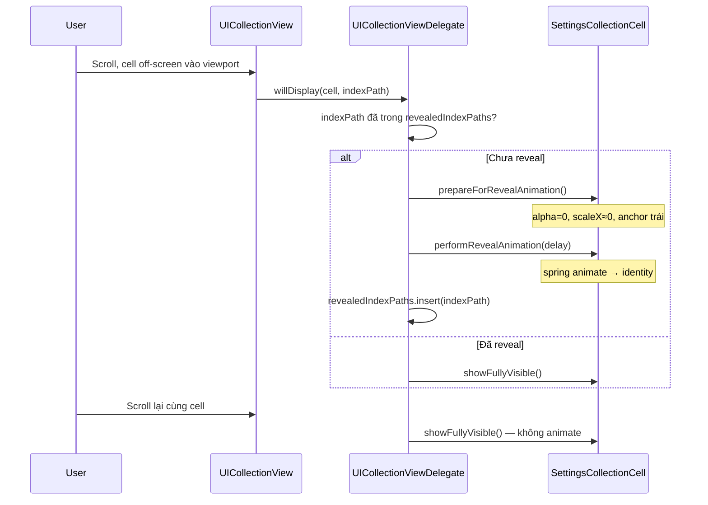

# Hiệu ứng cell “vẽ ra” khi scroll tới lần đầu

Tài liệu mô tả cách triển khai hiệu ứng **cell ở vùng chưa nhìn thấy được “vẽ” từ không có gì thành cell đầy đủ** khi cuộn tới — dựa trên implementation trong project **CellScrollExpandEffect** (màn Cài đặt), và hướng dẫn áp dụng cho UIKit / SwiftUI khác.

---

## Kết luận nhanh

| Thành phần | Vai trò |
|---|---|
| **`UICollectionViewDelegate.willDisplay`** | Trigger animation **lần đầu** cell vào viewport |
| **`revealedIndexPaths: Set<IndexPath>`** | Cache — không animate lại khi scroll qua cell đã thấy |
| **`SettingsCollectionCell.prepareForRevealAnimation()`** | Trạng thái ban đầu: `alpha = 0` + scale ngang ~0, anchor mép trái |
| **`SettingsCollectionCell.performRevealAnimation()`** | `UIView.animate` spring → cell “mở” trái → phải |
| **`UICollectionViewCompositionalLayout`** | Layout list + section background bo góc |
| **`PushDownCollectionViewCell`** | Hiệu ứng nhấn lún (scale 0.95) khi chạm |
| **`SettingsScreen` (SwiftUI)** | Cùng hiệu ứng qua `onAppear` + `revealedIDs` |

---

## Các lớp hiệu ứng trong project

| Hiệu ứng | Mô tả | File |
|---|---|---|
| **Cell reveal** (chính) | Cell từ ẩn/thu nhỏ → hiện đầy đủ, chỉ lần đầu scroll tới | `SettingsViewController`, `SettingsCollectionCell` |
| **Section background** | Khối trắng bo góc theo section | `SectionBackgroundView` |
| **Push down** | Scale 0.95 khi chạm cell | `PushDownCollectionViewCell` |
| **Self-sizing** (bổ trợ) | Cell cao theo nội dung multi-line | `.estimated(64)` trong layout |

---

## Luồng kỹ thuật — UIKit



---

## Implementation UIKit

### 1. `SettingsViewController` — layout + `willDisplay`

**Compositional Layout** — mỗi section là list dọc, có decoration nền trắng:

```swift
private func makeLayout() -> UICollectionViewCompositionalLayout {
    let layout = UICollectionViewCompositionalLayout { _, _ in
        self.makeSettingsSection()
    }
    layout.register(
        SectionBackgroundView.self,
        forDecorationViewOfKind: SectionBackgroundKind.elementKind
    )
    let config = UICollectionViewCompositionalLayoutConfiguration()
    config.interSectionSpacing = 16
    layout.configuration = config
    return layout
}
```

**Reveal chỉ lần đầu:**

```swift
private var revealedIndexPaths = Set<IndexPath>()

func collectionView(
    _ collectionView: UICollectionView,
    willDisplay cell: UICollectionViewCell,
    forItemAt indexPath: IndexPath
) {
    guard let cell = cell as? SettingsCollectionCell else { return }

    guard !revealedIndexPaths.contains(indexPath) else {
        cell.showFullyVisible()
        return
    }
    revealedIndexPaths.insert(indexPath)

    let visibleRow = collectionView.indexPathsForVisibleItems
        .sorted()
        .firstIndex(of: indexPath) ?? 0
    let delay = min(TimeInterval(visibleRow) * 0.04, 0.3)

    cell.prepareForRevealAnimation()
    cell.performRevealAnimation(delay: delay)
}
```

**Cấu hình collection view:**

- `collectionView.isPrefetchingEnabled = false` — tránh layout cell off-screen quá sớm.
- Nhiều section + đủ item (`SettingsData.sections`) — phần lớn cell ban đầu off-screen để thấy hiệu ứng khi scroll.

**Mở bản SwiftUI:** nút navigation bar phải present `UIHostingController(rootView: SettingsScreen())`.

### 2. `SettingsCollectionCell` — animation trên `contentView`

Transform áp lên **`contentView`**, không phải cell frame → không phá Auto Layout:

```swift
func prepareForRevealAnimation() {
    layoutIfNeeded()
    let width = contentView.bounds.width
    contentView.alpha = 0
    var transform = CGAffineTransform.identity
    transform = transform.translatedBy(x: -width / 2, y: 0)
    transform = transform.scaledBy(x: 0.0001, y: 1)
    contentView.transform = transform
}

func performRevealAnimation(delay: TimeInterval) {
    UIView.animate(
        withDuration: 0.45,
        delay: delay,
        usingSpringWithDamping: 0.9,
        initialSpringVelocity: 0.3,
        options: [.curveEaseOut, .allowUserInteraction],
        animations: {
            self.contentView.alpha = 1
            self.contentView.transform = .identity
        }
    )
}
```

`prepareForReuse()` gọi `showFullyVisible()` — cell tái sử dụng không giữ transform cũ.

### 3. Cell layout

- Layout ngang: icon | title + subtitle | chevron.
- `titleLabel` / `subtitleLabel`: `numberOfLines = 0` — multi-line Auto Layout.
- `layoutHeight = .estimated(64)` — self-sizing chiều cao.
- Kế thừa `PushDownCollectionViewCell` — scale khi `isHighlighted`.

### 4. `SectionBackgroundView`

Nền trắng `cornerRadius = 16`, shadow nhẹ. Gắn section qua `NSCollectionLayoutDecorationItem.background`.

### 5. `Model.swift` — dữ liệu

```swift
struct SettingsItem: Identifiable, Hashable {
    let title: String
    let subtitle: String
    let systemImageName: String
    var id: String { title }
}

enum SettingsData {
    static let items: [SettingsItem]
    static let sections: [[SettingsItem]]
    static func rowID(section: Int, item: Int) -> String
}
```

---

## Implementation SwiftUI

Màn `SettingsScreen` dùng **`ScrollView` + `LazyVStack`** — không bọc `UICollectionView`.

### Pattern: `onAppear` + cache (tương đương `willDisplay`)

```swift
private struct SettingsRowView: View {
    let item: SettingsItem
    let rowID: String
    @Binding var revealedIDs: Set<String>

    @State private var isVisible = false

    var body: some View {
        HStack(alignment: .center, spacing: 12) {
            Image(systemName: item.systemImageName)
                .foregroundStyle(.blue)
                .frame(width: 28, height: 28)
            VStack(alignment: .leading, spacing: 4) {
                Text(item.title).font(.headline)
                Text(item.subtitle).font(.subheadline).foregroundStyle(.secondary)
            }
            Spacer()
            Image(systemName: "chevron.right").foregroundStyle(.tertiary)
        }
        .padding(.horizontal, 16)
        .padding(.vertical, 12)
        .opacity(isVisible ? 1 : 0)
        .scaleEffect(x: isVisible ? 1 : 0.0001, y: 1, anchor: .leading)
        .onAppear {
            guard !revealedIDs.contains(rowID) else {
                isVisible = true
                return
            }
            revealedIDs.insert(rowID)
            withAnimation(.spring(response: 0.45, dampingFraction: 0.9)) {
                isVisible = true
            }
        }
    }
}
```

### Màn hình — nhiều section + nền trắng bo góc

```swift
struct SettingsScreen: View {
    @State private var revealedIDs = Set<String>()

    var body: some View {
        ScrollView {
            LazyVStack(spacing: 16) {
                ForEach(SettingsData.sections.indices, id: \.self) { sectionIndex in
                    VStack(spacing: 0) {
                        ForEach(
                            Array(SettingsData.sections[sectionIndex].enumerated()),
                            id: \.element.id
                        ) { itemIndex, item in
                            SettingsRowView(
                                item: item,
                                rowID: SettingsData.rowID(section: sectionIndex, item: itemIndex),
                                revealedIDs: $revealedIDs
                            )
                        }
                    }
                    .background(Color.white)
                    .clipShape(RoundedRectangle(cornerRadius: 16))
                    .shadow(color: .black.opacity(0.03), radius: 10, y: 2)
                    .padding(.horizontal, 16)
                }
            }
            .padding(.vertical, 16)
        }
        .background(Color(.systemGroupedBackground))
    }
}
```

### Host qua UIKit

```swift
let hostingController = UIHostingController(rootView: SettingsScreen())
hostingController.title = "Cài đặt (SwiftUI)"
present(UINavigationController(rootViewController: hostingController), animated: true)
```

### SwiftUI iOS 17+ — `scrollTransition` (tuỳ chọn)

```swift
SettingsRowView(...)
    .scrollTransition(.animated(.spring)) { content, phase in
        content
            .opacity(phase.isIdentity ? 1 : 0)
            .scaleEffect(x: phase.isIdentity ? 1 : 0.0001, y: 1, anchor: .leading)
    }
```

`scrollTransition` chạy **mỗi lần** row vào/ra viewport. Để chỉ animate lần đầu như UIKit: dùng `revealedIDs` + `onAppear`.

### So sánh UIKit vs SwiftUI

| | UIKit | SwiftUI |
|---|---|---|
| Trigger | `willDisplay` | `onAppear` |
| Cache | `Set<IndexPath>` | `Set<String>` |
| Animation | `UIView.animate` spring | `withAnimation(.spring)` |
| Anchor trái | `translate + scale` trên `contentView` | `.scaleEffect(anchor: .leading)` |
| Container | `UICollectionView` | `ScrollView` + `LazyVStack` |
| Section card | `SectionBackgroundView` | `background` + `clipShape` + `shadow` |

---

## Áp dụng cho project UIKit khác

### Checklist

- [ ] `UICollectionViewCompositionalLayout` + `.estimated` trên item và group
- [ ] (Tuỳ chọn) `NSCollectionLayoutDecorationItem.background` bo góc
- [ ] Cell layout ngang, Auto Layout multi-line
- [ ] `prepareForRevealAnimation()` + `performRevealAnimation()` trên `contentView`
- [ ] `UICollectionViewDelegate.willDisplay` + `Set<IndexPath>` cache
- [ ] `isPrefetchingEnabled = false` nếu cần
- [ ] Đủ item để scroll
- [ ] `prepareForReuse()` reset transform/alpha
- [ ] (Tuỳ chọn) kế thừa base cell push-down khi chạm

### Template tối thiểu

```swift
private var revealed = Set<IndexPath>()

func collectionView(
    _ collectionView: UICollectionView,
    willDisplay cell: UICollectionViewCell,
    forItemAt indexPath: IndexPath
) {
    guard let cell = cell as? MyRevealCell else { return }
    guard !revealed.contains(indexPath) else {
        cell.showFullyVisible()
        return
    }
    revealed.insert(indexPath)
    cell.prepareForRevealAnimation()
    cell.performRevealAnimation(delay: 0)
}
```

### Tinh chỉnh

| Mục tiêu | Cách |
|---|---|
| Nhanh/chậm hơn | Đổi `withDuration` / `usingSpringWithDamping` |
| Stagger nhiều cell | Tăng `delay` theo `indexPath.item` hoặc `visibleRow` |
| Reveal từ dưới lên | `translatedBy(x: 0, y: h/2)` + `scaledBy(x: 1, y: 0.0001)` |
| Tắt reveal | Bỏ `willDisplay` hoặc không gọi `prepareForRevealAnimation` |
| Reveal lại sau reload | `revealedIndexPaths.removeAll()` |

### Lưu ý data source

- `reloadData()` / diffable snapshot update: cân nhắc reset `revealedIndexPaths` nếu muốn animate lại toàn bộ.
- Insert/delete animation của collection view có thể **xung đột** cảm giác với reveal — nên chỉ dùng một cơ chế animation.

---

## Áp dụng cho project SwiftUI khác

### Checklist

- [ ] `ScrollView` + `LazyVStack` (hoặc `List` với row tùy chỉnh)
- [ ] `@State private var revealedIDs = Set<String>()`
- [ ] `.opacity` + `.scaleEffect(anchor: .leading)` trên row
- [ ] `onAppear` kiểm tra cache trước khi animate
- [ ] Section card: `background` + `clipShape(RoundedRectangle)` + `shadow`
- [ ] **Không** dùng `UIViewRepresentable` bọc `UICollectionView` — dùng native SwiftUI

### Push-down khi chạm (SwiftUI)

```swift
Button { } label: {
    rowContent
}
.buttonStyle(.plain)
.scaleEffect(isPressed ? 0.95 : 1)
.animation(.easeOut(duration: 0.2), value: isPressed)
```

Hoặc custom `ButtonStyle` với `configuration.isPressed`.

---

## File trong project

| File | Mô tả |
|---|---|
| `SettingsViewController.swift` | Layout + `willDisplay` reveal (UIKit) |
| `SettingsCollectionCell.swift` | Cell + reveal animation + push down |
| `SettingsScreen.swift` | Màn SwiftUI tương đương |
| `SectionBackgroundView.swift` | Decoration nền trắng section |
| `PushDownCollectionViewCell.swift` | Base cell nhấn lún |
| `Model.swift` | `SettingsItem`, `SettingsData` |
| `SceneDelegate.swift` | Bọc root trong `UINavigationController` |

---

## Test plan

1. Vào màn **Cài đặt** (UIKit) — vài cell đầu có thể reveal ngay.
2. Scroll xuống item chưa thấy — cell “mở” từ trái sang phải + fade in.
3. Scroll lên/xuống lại cùng item — **không** animate lại.
4. Chạm cell — scale push down (0.95).
5. Tap **SwiftUI** trên navigation bar — màn `SettingsScreen` hoạt động tương tự.
6. Scroll nhanh — cell reuse hiển thị đúng (`prepareForReuse`).
