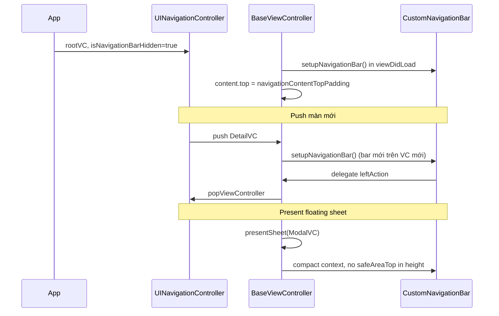

# Hướng dẫn xây dựng Custom Navigation (UIKit)

Tài liệu mô tả kiến trúc và quy trình triển khai **custom navigation bar** theo pattern hybrid UIKit: dùng `UINavigationController` native để quản lý stack, nhưng ẩn `UINavigationBar` hệ thống và render thanh navigation bằng `UIView` tùy chỉnh trên từng màn hình.

Mục tiêu: áp dụng cho **project UIKit khác** mà vẫn giữ hành vi navigation cơ bản (push/pop, swipe back, modal) **không xung đột** với UIKit.

---

## Mục lục

1. [Tổng quan kiến trúc](#1-tổng-quan-kiến-trúc)
2. [Nguyên tắc thiết kế](#2-nguyên-tắc-thiết-kế)
3. [Cấu trúc module](#3-cấu-trúc-module)
4. [Custom Navigation Bar](#4-custom-navigation-bar)
5. [Metrics, Layout Context & Safe Area](#5-metrics-layout-context--safe-area)
6. [Base View Controller](#6-base-view-controller)
7. [Tích hợp UINavigationController](#7-tích-hợp-uinavigationcontroller)
8. [Màn hình con & Delegate](#8-màn-hình-con--delegate)
9. [Present Modal](#9-present-modal)
10. [Status Bar & Scroll Insets](#10-status-bar--scroll-insets)
11. [Swipe Back Gesture](#11-swipe-back-gesture)
12. [Hạn chế & phạm vi chưa triển khai](#12-hạn-chế--phạm-vi-chưa-triển-khai)
13. [Checklist triển khai](#13-checklist-triển-khai)
14. [Anti-patterns cần tránh](#14-anti-patterns-cần-tránh)
15. [Tham chiếu mã nguồn trong project](#15-tham-chiếu-mã-nguồn-trong-project)

---

## 1. Tổng quan kiến trúc

### Mô hình hybrid

| Lớp | Vai trò | Native hay Custom |
|-----|---------|-------------------|
| `UINavigationController` | Quản lý stack push/pop, interactive pop gesture | Native (ẩn UI) |
| `CustomNavigationBar` (`UIView`) | Hiển thị title, back, action buttons, search field | Custom |
| `BaseViewController` | Gắn nav bar, sync status bar, layout cache, gesture | Base class |
| `NavigationBarDelegate` | Xử lý tap back / right / search | Protocol |
| `NavigationBarMetrics` + `LayoutHelper` | Nguồn sự thật duy nhất cho kích thước nav | Utility |
| `UIViewController+Presentation` | API present modal (fullscreen, sheet, stacked) | Extension |

```
┌─────────────────────────────────────────┐
│  UINavigationController                 │
│  isNavigationBarHidden = true           │
│  ┌───────────────────────────────────┐  │
│  │  YourViewController               │  │
│  │  ┌─────────────────────────────┐  │  │
│  │  │ CustomNavigationBar           │  │  │  ← safeAreaTop + content
│  │  ├─────────────────────────────┤  │  │
│  │  │                             │  │  │
│  │  │  Content                    │  │  │  ← top offset = full bar height
│  │  │                             │  │  │
│  │  └─────────────────────────────┘  │  │
│  └───────────────────────────────────┘  │
└─────────────────────────────────────────┘
```

### Vì sao không subclass `UINavigationBar`?

- Kiểm soát layout tự do (background image, search field, nhiều nút phải, large title).
- Mỗi màn tự quản lý appearance (`hasBackground`, `isPush` → back vs close, `TitleStyle`).
- Tránh conflict với `UINavigationBarAppearance` (iOS 13+) và large title native.
- Dễ tái sử dụng ngoài navigation stack (modal full screen, sheet).

---

## 2. Nguyên tắc thiết kế

1. **Một nguồn sự thật cho kích thước** — tất cả chiều cao nav nằm trong `NavigationBarMetrics`, facade qua `LayoutHelper`.
2. **Ẩn native, không xóa native** — luôn `isNavigationBarHidden = true` trên mọi `UINavigationController`.
3. **Mỗi VC sở hữu nav bar riêng** — nav bar là subview của VC, đi theo khi push/pop.
4. **Action qua delegate** — không dùng `navigationItem.leftBarButtonItem`.
5. **Content offset = toàn bộ chiều cao nav bar** — `LayoutHelper.navigationContentTopPadding(for:titleStyle:)` trả về `safeAreaTop + contentHeight` (context `.standard`), không chỉ 44pt toolbar.
6. **Hai layout context** — `.standard` (push/root/fullscreen) và `.compact` (sheet, stacked card, form sheet): compact bỏ `safeAreaTop` khỏi chiều cao bar.
7. **Layout cache** — `BaseViewController` và `CustomNavigationBar` chỉ cập nhật constraint khi context/height thực sự thay đổi.
8. **Status bar sync trong `viewDidAppear`** — đọc từ `customNavigationBar.statusBarStyle`.

---

## 3. Cấu trúc module

```
CustomNavigation/
├── UI/
│   ├── Navigation/
│   │   ├── CustomNavigationBar.swift
│   │   ├── CustomNavigationBar.xib
│   │   ├── NavigationBarDelegate.swift
│   │   ├── NavigationType.swift
│   │   ├── TitleStyle.swift
│   │   └── NavigationTheme.swift
│   └── Base/
│       └── BaseViewController.swift
├── Utils/
│   ├── NavigationBarMetrics.swift      ← single source of truth
│   ├── LayoutHelper.swift
│   ├── UIViewController+Presentation.swift
│   ├── StackedCardPresentationController.swift
│   └── UIColor+Brightness.swift
├── Demo/
│   ├── HomeViewController.swift
│   ├── DetailViewController.swift
│   ├── SearchViewController.swift
│   └── ModalViewController.swift
└── SceneDelegate.swift
```

---

## 4. Custom Navigation Bar

### 4.1. NavigationType — layout mode

```swift
enum NavigationType {
    case standard              // chỉ title, không back
    case backButton            // back + tối đa 2 nút phải (text/image)
    case backButtonIcon        // back + 1 nút phải dạng icon+text
    case searchBackButton      // back + search field + nút phải
    case onlyRightButton       // không back, chỉ nút phải
}
```

### 4.2. TitleStyle — kiểu tiêu đề

```swift
public enum TitleStyle {
  case inline        // title nhỏ căn giữa (mặc định)
  case large         // title lớn căn trái phía dưới hàng action
  case largeLeading  // title lớn căn trái tại hàng action, ẩn nút Back
}
```

Large title được render bằng `UILabel` programmatic (không dùng `UINavigationBar` large title mode).

### 4.3. NavigationBarDelegate

```swift
@objc protocol NavigationBarDelegate: AnyObject {
    @objc optional func navigationBar(_ bar: CustomNavigationBar, leftAction sender: Any)
    @objc optional func navigationBar(_ bar: CustomNavigationBar, firstRightAction sender: Any)
    @objc optional func navigationBar(_ bar: CustomNavigationBar, secondRightAction sender: Any)
    @objc optional func navigationBar(_ bar: CustomNavigationBar, searchEditingChanged keyword: String)
    @objc optional func navigationBar(_ bar: CustomNavigationBar, searchEditingDidEnd keyword: String)
}
```

Dùng `@objc optional` để màn hình chỉ implement action cần thiết.

### 4.4. Thuộc tính quan trọng

| Property | Mô tả |
|----------|-------|
| `type: NavigationType` | Layout mode, `didSet` → `updateAppearance()` |
| `titleStyle: TitleStyle` | Inline / large / largeLeading |
| `title: String` | Tiêu đề |
| `isPush: Bool` | `true` → icon back; `false` → icon close (modal) |
| `hasBackground: Bool` | `true` → nền brand + chữ trắng; `false` → nền trong suốt |
| `listRightButtons: [Any]` | Mảng `String` hoặc `UIImage`, tối đa 2 phần tử |
| `singleButtonComponents: (String?, UIImage?)` | Cho layout `backButtonIcon` |
| `layoutContext: NavigationBarLayoutContext` | `.standard` hoặc `.compact` — tự sync từ `BaseViewController` |
| `noBackgroundTintColor: UIColor` | Màu icon/chữ khi `hasBackground = false` |

### 4.5. Khởi tạo từ XIB

```swift
extension CustomNavigationBar {
    static func loadFromNib(width: CGFloat, height: CGFloat) -> CustomNavigationBar {
        let nib = UINib(nibName: "CustomNavigationBar", bundle: nil)
        let bar = nib.instantiate(withOwner: nil, options: nil).first as! CustomNavigationBar
        bar.frame = CGRect(x: 0, y: 0, width: width, height: height)
        return bar
    }
}
```

### 4.6. Status bar style

```swift
var statusBarStyle: UIStatusBarStyle {
    guard hasBackground else {
        return noBackgroundTintColor.isDark ? .default : .lightContent
    }
    return .lightContent
}
```

---

## 5. Metrics, Layout Context & Safe Area

### 5.1. NavigationBarMetrics — single source of truth

```swift
enum NavigationBarMetrics {
    enum Toolbar {
        static let height: CGFloat = 44
        static let verticalBias: CGFloat = 4
    }
    enum Compact {          // sheet / stacked / form sheet
        static let additionalHeight: CGFloat = 8   // bar = 52pt
        static let verticalBias: CGFloat = 2
    }
    enum LargeTitle {
        static let rowHeight: CGFloat = 36
        static let toolbarGap: CGFloat = 8
        static let bottomInset: CGFloat = 8
    }
}
```

| Context | Toolbar band | Large title extra | Tổng content (inline) | Tổng bar height |
|---------|-------------|-------------------|----------------------|-----------------|
| `.standard` | 44pt | +44pt (`.large`) | 44pt | `safeAreaTop + content` |
| `.compact` | 52pt | +44pt (`.large`) | 52pt | `content` only |

### 5.2. LayoutHelper

```swift
// Chiều cao nav bar đầy đủ cho một VC (tự detect context)
LayoutHelper.navigationBarHeight(titleStyle: .large, for: viewController)

// Offset top cho content body — bằng toàn bộ chiều cao nav bar
LayoutHelper.navigationContentTopPadding(for: viewController, titleStyle: .largeLeading)
```

### 5.3. Compact context — tự động detect

```swift
extension UIViewController {
    var requiresCompactNavigationBar: Bool {
        // .pageSheet, .formSheet, .custom (stacked card)
    }
}
```

Khi present floating sheet hoặc stacked card (bọc trong `UINavigationController`), nav bar bên trong sheet dùng context `.compact`: không cộng `safeAreaTop`, toolbar cao hơn 8pt so với standard.

---

## 6. Base View Controller

### 6.1. API chính

```swift
class BaseViewController: UIViewController {
    var customNavigationBar: CustomNavigationBar?
    var navigationTitleStyle: TitleStyle = .inline
    var statusBarStyle: UIStatusBarStyle = .lightContent
    var isSwipeBackEnabled: Bool = true

    func setupNavigationBar(
        owner: UIViewController,
        title: String,
        type: NavigationType = .backButton,
        titleStyle: TitleStyle = .inline,
        isPush: Bool = true,
        hasBackground: Bool = true
    )

    func pinNavigationBarToTop()
    func updateNavigationBarLayoutIfNeeded()  // gọi tự động trong layout lifecycle
}
```

### 6.2. Layout lifecycle

- `viewDidLayoutSubviews` và `viewDidAppear` → `updateNavigationBarLayoutIfNeeded()`
- Cache so sánh `(context, barHeight, safeAreaTop)` — chỉ update constraint khi thay đổi
- `pinNavigationBarToTop()` tạo height constraint động, cập nhật qua `navigationBarHeightConstraint`

### 6.3. Ví dụ setup

```swift
override func viewDidLoad() {
    super.viewDidLoad()
    setupNavigationBar(
        owner: self,
        title: "Chi tiết",
        type: .backButton,
        titleStyle: .large,
        isPush: true,
        hasBackground: true
    )
    customNavigationBar?.listRightButtons = ["Sửa", UIImage(systemName: "square.and.arrow.up") as Any]
    pinNavigationBarToTop()
}
```

---

## 7. Tích hợp UINavigationController

### 7.1. App launch

```swift
// SceneDelegate
let rootVC = HomeViewController()
let nav = UINavigationController(rootViewController: rootVC)
nav.isNavigationBarHidden = true   // BẮT BUỘC
window?.rootViewController = nav
```

### 7.2. Modal có navigation stack

```swift
presentModal(viewController, presentation: .sheet)  // tự bọc UINavigationController + ẩn native bar
```

### 7.3. Quy tắc

| Tình huống | Việc cần làm |
|------------|--------------|
| Push màn mới | VC mới tự `setupNavigationBar` trong `viewDidLoad` |
| Pop | Nav bar của VC bị pop đi theo — không cần cleanup |
| Present modal có stack | `presentModal` với `wrapInNavigation: true` (mặc định) |
| Content offset | `LayoutHelper.navigationContentTopPadding(for:titleStyle:)` |

---

## 8. Màn hình con & Delegate

### 8.1. Push với large title

```swift
final class DetailViewController: BaseViewController {
    override func viewDidLoad() {
        super.viewDidLoad()
        setupNavigationBar(owner: self, title: "Chi tiết", titleStyle: .large)
        pinNavigationBarToTop()
        // content.top = navigationContentTopPadding(for: self, titleStyle: .large) + spacing
    }
}

extension DetailViewController: NavigationBarDelegate {
    func navigationBar(_ bar: CustomNavigationBar, leftAction sender: Any) {
        navigationController?.popViewController(animated: true)
    }
}
```

### 8.2. Search navigation

```swift
setupNavigationBar(owner: self, title: "", type: .searchBackButton, hasBackground: false)
```

Search field hiển thị tĩnh trong nav bar. Delegate `searchEditingChanged` nhận keyword realtime.

### 8.3. Modal (nút Close)

```swift
setupNavigationBar(owner: self, title: "Xác nhận", isPush: false)

func navigationBar(_ bar: CustomNavigationBar, leftAction sender: Any) {
    dismiss(animated: true)
}
```

### 8.4. Demo screens trong project

| Màn | TitleStyle | NavigationType | Ghi chú |
|-----|-----------|----------------|---------|
| `HomeViewController` | `.largeLeading` | `.standard` | Root, nút chuông phải |
| `DetailViewController` | `.large` | `.backButton` | Push, 2 nút phải |
| `SearchViewController` | `.inline` | `.searchBackButton` | Nav trong suốt |
| `ModalViewController` | `.inline` | `.backButton` | 3 mode: fullscreen / sheet / stacked |

---

## 9. Present Modal

Project cung cấp `ModalPresentation` enum và shortcut API qua `UIViewController+Presentation.swift`.

### 9.1. Các kiểu present

| API | `ModalPresentation` | Hành vi |
|-----|---------------------|---------|
| `presentFullScreen()` / `presentCovering()` | `.covering` | `.fullScreen` — màn dưới ra khỏi hierarchy |
| `presentSheet()` | `.sheet` | `.pageSheet` — card nổi, detent medium + near-full |
| `presentStacked()` | `.stacked` | `.custom` — màn dưới scale & lùi xuống |
| — | `.form` | `.formSheet` — khung giữa (iPad) |
| — | `.overCovering` | `.overFullScreen` — che kín, giữ hierarchy |

### 9.2. Floating sheet vs Stacked card

Đây là hai hành vi **khác nhau có chủ đích**:

| | Floating sheet | Stacked card |
|---|----------------|--------------|
| Cơ chế | `UISheetPresentationController` | `StackedCardPresentationController` (custom) |
| Mở đầu | Nửa màn (`.medium()`) | Peek ~10% phía trên |
| Expand full | Near-full, **chỉ dim nền** | Scale màn dưới ~0.94, translate xuống |
| Màn presenting | Giữ nguyên kích thước | Thu nhỏ + bo góc |
| Grabber | Có (mặc định) | Không |
| Dismiss | System sheet gesture | Pan từ vùng top 120pt |

**Floating sheet — tránh scale màn dưới:**

System `.large()` detent khiến iOS scale presenting view. Project dùng custom detent `.floatingExpanded()` (`maximumDetentValue - 1pt`) thay thế `.large()` (iOS 16+). Trên iOS 15 fallback về `.large()` — hạn chế của system API.

```swift
presentSheet(ModalViewController(mode: .floatingSheet))
// detents mặc định: [.medium(), .floatingExpanded()]
```

**Stacked card:**

```swift
presentStacked(ModalViewController(mode: .stackedCard))
```

### 9.3. Push animation tùy chọn

```swift
pushFromTop(viewController)   // CATransition .moveIn fromTop
popToBottom()                 // CATransition .reveal fromBottom
```

Custom nav bar vẫn hoạt động vì gắn trên VC, không phụ thuộc transition của `UINavigationController`. Đây là transition toàn màn, **không** phải animation morph title/search native.

### 9.4. Top ViewController helper

```swift
UIApplication.topViewController()  // deep link, notification routing
```

---

## 10. Status Bar & Scroll Insets

### 10.1. Đồng bộ status bar

`BaseViewController` gọi `syncStatusBarFromNavigationBar()` trong `viewDidAppear`.

### 10.2. UITableView / UICollectionView

```swift
tableView.contentInsetAdjustmentBehavior = .never

tableView.topAnchor.constraint(
    equalTo: view.topAnchor,
    constant: LayoutHelper.navigationBarHeight(titleStyle: .inline, for: self)
)
```

### 10.3. Màn không có nav bar

Không gọi `setupNavigationBar`; content pin theo `safeAreaLayoutGuide.top`.

---

## 11. Swipe Back Gesture

`BaseViewController` conform `UIGestureRecognizerDelegate`:

```swift
nav.interactivePopGestureRecognizer?.isEnabled = isSwipeBackEnabled && !isRoot
nav.interactivePopGestureRecognizer?.delegate = self
```

`gestureRecognizerShouldBegin` chặn swipe khi là root hoặc `isSwipeBackEnabled = false`.

---

## 12. Hạn chế & phạm vi chưa triển khai

Project **cố ý** giữ phạm vi tập trung vào layout, metrics và presentation modal. Các hiệu ứng animation navigation **giống native Apple** dưới đây **chưa có** và **chưa có định hướng triển khai** trong project:

### 12.1. Transition title khi push / pop

| Hiệu ứng native | Trạng thái project |
|-----------------|-------------------|
| Large title thu nhỏ (collapse) thành inline title khi push | ❌ Chưa có — mỗi VC có nav bar riêng, xuất hiện tĩnh |
| Cross-fade / slide title giữa màn A → B | ❌ Chưa có |
| Large title `.largeLeading` → `.large` chuyển tiếp mượt | ❌ Chưa có |
| Title alignment morph (center ↔ leading) | ❌ Chưa có |

Push/pop dùng transition mặc định của `UINavigationController` (slide ngang) hoặc `pushFromTop` / `popToBottom` (CATransition toàn màn). Nav bar **không** tham gia `UIViewControllerAnimatedTransitioning`.

### 12.2. Transition search bar

| Hiệu ứng native | Trạng thái project |
|-----------------|-------------------|
| Nút search morph thành search field full-width khi push | ❌ Chưa có |
| Search bar collapse về icon khi pop | ❌ Chưa có |
| `UISearchController` integration với navigation transition | ❌ Chưa có — dùng `UITextField` tĩnh trong `searchBackButton` |
| Focus animation khi vào màn search | ❌ Chưa có |

### 12.3. Large title khi scroll

| Hiệu ứng native | Trạng thái project |
|-----------------|-------------------|
| Large title collapse khi scroll content (`UIScrollView` observation) | ❌ Chưa có |
| Blur / material nav bar khi scroll | ❌ Chưa có |

### 12.4. Lý do kiến trúc

Pattern hybrid (mỗi VC sở hữu nav bar độc lập) đơn giản và dễ maintain, nhưng **loại bỏ** khả năng dùng `UINavigationBar` transition coordinator. Để đạt animation native cần một trong các hướng (ngoài phạm vi project hiện tại):

- Shared `UINavigationBar` instance trên `UINavigationController` với custom transition coordinator
- `UIViewControllerAnimatedTransitioning` + snapshot/morph layer giữa hai nav bar
- Quay lại dùng `UINavigationBar` native với `UINavigationBarAppearance` tùy chỉnh (trade-off layout freedom)

**Khuyến nghị:** Nếu app cần animation title/search native, cân nhắc giữ `UINavigationBar` visible với appearance tùy chỉnh thay vì pattern này — hoặc chấp nhận transition tĩnh như hiện tại.

### 12.5. Hạn chế khác

| Hạn chế | Chi tiết |
|---------|----------|
| Floating sheet trên iOS 15 | Fallback `.large()` detent — có thể scale màn dưới khi expand full |
| Keyboard trong sheet | Custom near-full detent có thể bị system override khi focus text field |
| Bottom tab bar custom | Chưa có trong project — chỉ có hướng dẫn pattern chung nếu cần mở rộng |
| Dark mode / Dynamic Type | Nav bar dùng font cố định; chưa có scale theo content size category |

---

## 13. Checklist triển khai

### Phase 1 — Core

- [ ] `CustomNavigationBar.xib` + class
- [ ] `NavigationType`, `TitleStyle`, `NavigationBarDelegate`
- [ ] `NavigationBarMetrics` + `LayoutHelper`
- [ ] `BaseViewController` với setup, pin, layout cache
- [ ] Ẩn native bar ở root `UINavigationController`
- [ ] Demo push + modal close

### Phase 2 — Layout & presentation

- [ ] `TitleStyle.large` / `.largeLeading`
- [ ] Compact context cho sheet/stacked
- [ ] `presentSheet`, `presentStacked`, `presentFullScreen`
- [ ] Swipe back gesture + `UIGestureRecognizerDelegate`
- [ ] Search variant (`searchBackButton`)

### Phase 3 — Polish (tuỳ chọn)

- [ ] `NavigationTheme` brand color
- [ ] `pushFromTop` / `popToBottom`
- [ ] Unit test `NavigationBarMetrics` trên simulator notch / non-notch / sheet

### Phase 4 — Migration project cũ

- [ ] Audit màn đang dùng `navigationItem` → chuyển sang `BaseViewController`
- [ ] Remove `UINavigationBar.appearance()` global nếu conflict
- [ ] Thống nhất `navigationContentTopPadding` — dùng full bar height, không hard-code 44/64/88

---

## 14. Anti-patterns cần tránh

| ❌ Tránh | ✅ Nên |
|---------|--------|
| Gắn 1 nav bar chung trên `UINavigationController.view` | Mỗi VC tự có nav bar subview |
| Để `isNavigationBarHidden = false` | Luôn ẩn native bar |
| Hard-code `topPadding = 64` / `88` | Dùng `LayoutHelper.navigationContentTopPadding(for:titleStyle:)` |
| Chỉ offset 44pt cho content trên màn standard | Offset = full `navigationBarHeight` (gồm safe area) |
| Dùng `navigationItem` song song custom bar | Chỉ dùng delegate |
| Nhầm floating sheet với stacked card | Dùng đúng API: `presentSheet` vs `presentStacked` |
| Truyền `.large()` detent cho floating sheet (iOS 16+) | Để default hoặc dùng `.floatingExpanded()` |
| Modal không bọc `UINavigationController` khi cần push tiếp | `presentModal(wrapInNavigation: true)` |

---

## 15. Tham chiếu mã nguồn trong project

| Thành phần | Đường dẫn |
|------------|-----------|
| Custom nav bar | `UI/Navigation/CustomNavigationBar.swift` + `.xib` |
| Title style | `UI/Navigation/TitleStyle.swift` |
| Navigation types | `UI/Navigation/NavigationType.swift` |
| Delegate protocol | `UI/Navigation/NavigationBarDelegate.swift` |
| Brand theme | `UI/Navigation/NavigationTheme.swift` |
| Base VC | `UI/Base/BaseViewController.swift` |
| Metrics (SSOT) | `Utils/NavigationBarMetrics.swift` |
| Layout helper | `Utils/LayoutHelper.swift` |
| Present modal APIs | `Utils/UIViewController+Presentation.swift` |
| Stacked card presentation | `Utils/StackedCardPresentationController.swift` |
| Demo screens | `Demo/HomeViewController.swift`, `DetailViewController.swift`, `SearchViewController.swift`, `ModalViewController.swift` |
| App entry | `SceneDelegate.swift` |

---

## Phụ lục — Sơ đồ luồng vòng đời



---

*Tài liệu phản ánh implementation trong project CustomNavigation. Cập nhật: tháng 6/2026.*
